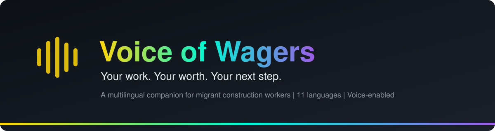
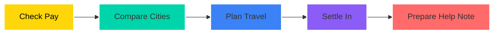
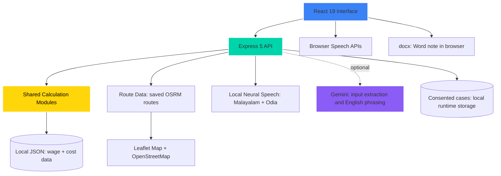

<div align="center">




<p align="center">
  
  
  
  
  
</p>
<p align="center">
  
</p>


</div>


<p align="center">
  
  
  
</p>


<div align="center">

<br/>
<sub>Arrival offers four sections: Help, Stay, Documents and Local words. City illustrations follow the chosen destination.</sub>
</div>


## Our Vision

> Voice of Wagers is a multilingual companion that helps migrant construction workers understand their pay, compare cities and find support after they arrive. Moving for work should not mean making decisions in the dark: wage information, living-cost estimates, road planning and official support come together in one simple, voice-enabled experience.

<table>
<tr>
<td width="50%" align="center">

### Before Voice of Wagers
```yaml
Pay Benchmarks:    scattered across websites
Language:          unfamiliar, hard to follow
Rent / Food Costs: guesswork
Travel Planning:   separate tools
Help on Arrival:   "who do I ask?"
```

</td>
<td width="50%" align="center">

### After Voice of Wagers
```yaml
Pay Benchmarks:    sourced, beside the numbers
Language:          11 languages + read-aloud
Rent / Food Costs: clear city cards + savings
Travel Planning:   in-app road map + km
Help on Arrival:   Help, Stay, Documents, Words
```

</td>
</tr>
</table>


## The Worker Journey




## Live Architecture



> The core demo runs without an AI key. Gemini is optional and cannot replace the wage calculations or their source data.


## Tech Stack

<table align="center">
<tr>
<td width="33%" align="center">

**Interface & Maps**


<br/>


<br/>


</td>
<td width="33%" align="center">

**Backend & Documents**


<br/>


</td>
<td width="33%" align="center">

**Speech & Optional AI**


<br/>


</td>
</tr>
</table>


## Core Capabilities

<table>
<tr>
<td width="33%" valign="top">

### My Wage
* Supplied **wage benchmark** by city and work type
* Source and **checking advice** shown beside the number

### Cities
* Compare **pay, shared rent, food and savings**
* Clear city cards with focused detail panels

</td>
<td width="33%" valign="top">

### My Route
* Choose start and destination from **6 cities**
* **Road map and kilometres** inside the app

### Arrival
* Four tabs: **Help, Stay, Documents, Local words**
* First-day checklist kept close at hand

</td>
<td width="33%" valign="top">

### Fair Pay
* Enter **daily, weekly or monthly** pay
* Transparent comparison with the supplied benchmark

### Get Help
* With **consent**, prepare a local pay note
* Download a readable **Word document** in the chosen language

</td>
</tr>
</table>


## Designed For People First

<table align="center">
<tr>
<th>Feature</th>
<th>Details</th>
<th>Result</th>
</tr>
<tr>
<td><strong>11 Languages</strong></td>
<td>English, Hindi, Bengali, Marathi, Telugu, Tamil, Gujarati, Urdu, Kannada, Odia, Malayalam</td>
<td>Workers read in their own language</td>
</tr>
<tr>
<td><strong>Right-to-Left</strong></td>
<td>Urdu uses a right-to-left layout</td>
<td>Natural reading direction</td>
</tr>
<tr>
<td><strong>Read-Aloud</strong></td>
<td>Prefers a matching browser voice; local neural fallback for Malayalam and Odia</td>
<td>Usable without strong reading skills</td>
</tr>
<tr>
<td><strong>Voice Input</strong></td>
<td>Depends on browser, device and mic permission; typing always works</td>
<td>Never blocked</td>
</tr>
<tr>
<td><strong>Interface</strong></td>
<td>Light glass UI, clear yellow action buttons, destination illustrations, responsive layouts</td>
<td>Easy to recognise each step</td>
</tr>
</table>


## City Coverage

| Feature | Patna | Noida | Chennai | Delhi | Gurgaon | Mumbai |
|---|:---:|:---:|:---:|:---:|:---:|:---:|
| Route planning | Yes | Yes | Yes | Yes | Yes | Yes |
| Wage information | No | Yes | Yes | Yes | Yes | Yes |
| Arrival information | No | Yes | Yes | Yes | Yes | Yes |

> Patna is included for travel planning only. The app does not invent missing wage or arrival information.


## Setup & Installation

**Prerequisites:** Node.js 22+, npm and Git. Python 3.9 to 3.12 is needed only for local neural speech and the evaluation runner. Internet is needed for dependency/model downloads and map tiles.

```bash
# 1. Clone and install
git clone https://github.com/SURYATSG786/Voice-of-Wagers.git
cd Voice-of-Wagers
npm ci

# 2. Build and run
npm run build
npm start
```

Open **http://127.0.0.1:3001** for the landing page. Choose **Start with Saathi** to reach the dashboard at `/home`. No API key is required for the core demo.

<details>
<summary><strong>Optional: local speech for Malayalam and Odia</strong></summary>

```bash
npm run setup:speech
```

Creates an isolated Python environment and downloads pinned model files (about 1 GB). Models are excluded from Git. Review `licenses/README.md` before commercial use. Restart the app after setup if it was already running.

</details>

<details>
<summary><strong>Development mode</strong></summary>

```bash
npm run dev
```

Open **http://127.0.0.1:5173**. Starts Vite and the Express API together.

</details>

<details>
<summary><strong>Configuration and troubleshooting</strong></summary>

| Issue | Fix |
|---|---|
| Port 3001 busy | `PORT=3002 npm start` (or set `PORT` in a local `.env`) |
| Want Gemini | Copy `.env.example` to `.env` and set your own `GEMINI_API_KEY`. Keep it on the server and out of Git |
| Speech recognition unavailable | Type the same details instead |
| Map not loading | Check your internet connection (OpenStreetMap tiles) |

</details>


## Two-Minute Demo For Judges

| Step | Action |
|---|---|
| 1 | **Explore:** choose a language on Home, compare city cards and open their sources |
| 2 | **Travel:** plan Patna to Chennai, show the road map and kilometres, then explore the Arrival tabs |
| 3 | **Check pay:** choose Noida, Helper and Rs 300 per day. Result: **Rs 7,800 a month vs Rs 13,690, a difference of Rs 5,890** |
| 4 | **Get a copy:** choose Ask for Help, give consent and download the Word note. Nothing is sent to an organisation; a person must review it |


## Verification

```bash
npm run setup:speech   # needed for the full speech tests
npm test
npm run eval
npm run build
```

<p align="center">
  
  
  
</p>

Tests cover calculations, APIs, routes, languages and Word content in all eleven languages. GitHub Actions repeats tests, evaluation and build. See [`TESTING.md`](./TESTING.md) for evidence and known limits, including desktop/phone checks and visual review of the English Word export.


## Repository Structure

```text
client/       React interface and assets
server/       Express API and local speech service
lib/          Calculations, parsing, routes and Word exports
data/         Translations, wage/cost data and saved routes
eval/         Tests, evaluation and verification reports
scripts/      Local speech setup
licenses/     Speech model attribution and terms
screenshots/  Interface previews
docs/         Project context
TESTING.md    Verification evidence and known limits
```


## Q&A

<details>
<summary><strong>Click to expand</strong></summary>

**Q1: Are the wage numbers legally binding?**
> No. Wage figures are supplied benchmarks that require confirmation with the labour office. They are not legal rulings or job offers.

**Q2: Does it need an AI key to work?**
> No. The core demo is deterministic and runs without a key. Optional server-side Gemini only helps with input extraction and limited English phrasing; it cannot replace the calculations or source data.

**Q3: What happens to a worker's consented help note?**
> It is saved locally in ignored runtime storage, and the Word copy is generated in the browser on request. Nothing is sent to an NGO or government body; a person must review it.

**Q4: What if voice input or read-aloud is unavailable?**
> Users can always type. Read-aloud prefers a matching browser voice, with a local neural fallback for Malayalam and Odia once the models are installed.

</details>


## Responsible Scope

* Wage figures need confirmation with the labour office; they are not legal rulings or job offers.
* Living costs and savings are **estimates**. Routes join approximate city centres and give **no live traffic or train/bus schedules**.
* State-wide worker records are not city counts or employer safety ratings.
* No NGO or government submission is connected. Searches and consented cases stay in ignored local runtime storage.
* Optional Gemini may send entered text to an external service. Keep personal details out of free text when it is enabled.
* Translation and pronunciation quality have **not** been certified by native-language reviewers.
* Public hosting and real case review require further setup.


## Roadmap

1. **Native-language review** of translations and pronunciation
2. **Regularly verified wage notifications** from official sources
3. **Secure deployment** for public hosting
4. **Consent-based partnerships** for real human support


<div align="center">


<sub>Repo: <a href="https://github.com/SURYATSG786/Voice-of-Wagers">SURYATSG786/Voice-of-Wagers</a></sub>

</div>
