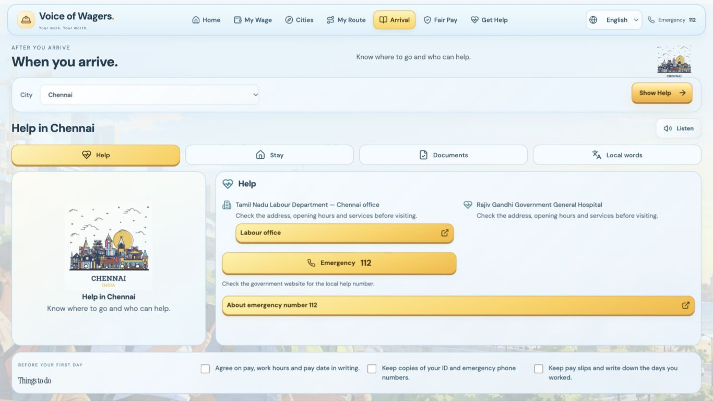

# Voice of Wagers

A multilingual companion for migrant construction workers. Compare wages and living costs, plan a journey, find arrival help and check your pay in simple words.



Arrival offers four simple sections: Help, Stay, Documents and Local words. Supplied city illustrations follow the chosen destination, with the route picture immediately above the pay summary.

## Get started

Requires **Node.js 22+**, npm, and Python 3.9–3.12 for optional local neural speech.

```sh
npm ci
npm run build
npm start
```

Open **http://127.0.0.1:3001**. If that port is busy, use `PORT=3002 npm start`.

For development, run `npm run dev` and open http://127.0.0.1:5173.

To enable Malayalam and Odia speech on devices without matching browser voices:

```sh
npm run setup:speech
```

This downloads pinned local speech models and creates an isolated Python environment (about 1 GB). See [speech licenses](licenses/README.md) before commercial use. Model weights are not committed.

## What you can do

- **My Wage:** see the supplied wage benchmark and its source.
- **Cities:** compare pay, rent, food and estimated savings using clear city cards. Tap Details for a focused, accessible panel with next steps and sources.
- **My Route:** choose any of Patna, Noida, Chennai, Delhi, Gurgaon or Mumbai as the start or destination; see a road map and kilometres inside the app.
- **Arrival:** find official help, useful phrases and a simple arrival checklist.
- **Fair Pay:** compare entered pay with the supplied benchmark.
- **Get Help:** create a consented local review record. Delivery to an NGO is not connected.

The interface supports **English, Hindi, Bengali, Marathi, Telugu, Tamil, Gujarati, Urdu, Kannada, Odia and Malayalam**. Urdu uses a right-to-left layout. Read-aloud prefers a matching browser voice; Malayalam and Odia have a local neural fallback. Translations have automated checks and selected corrections, but have not been certified by native-language reviewers.

## Project structure

```text
client/       React interface, styles and supplied city illustrations
server/       Express API and local speech service
lib/          Wage calculations, parsing, translations and route validation
data/         Wage/cost data, translations, sourced records and saved road routes
eval/         Automated tests, fixtures and browser verification reports
scripts/      Local speech setup
licenses/     Speech model attribution and usage terms
screenshots/  Interface previews
docs/         Build context and project history
TESTING.md    Verification evidence and known limits
```

## Verification

```sh
npm run setup:speech  # required for the real speech tests
npm test
npm run eval
npm run build
```

Latest local result: **155 automated tests passed**, production build passed, and **110 city-dialog language/layout checks passed** across all five cities and eleven languages at desktop and phone sizes. See [TESTING.md](TESTING.md). GitHub Actions repeats the automated tests and build on pushes and pull requests.

## Data and service limits

Wage figures still need confirmation with the labour office; they are not a legal ruling or a job offer. Rent, food, savings and travel costs are planning estimates. Saved driving routes join approximate city centres; they do not provide live traffic, train/bus schedules or exact-address navigation. OpenStreetMap tiles need internet.

Chennai and Gurgaon show official **state-wide** worker records with distinct metrics and dates. These figures are not city counts, employer ratings or safety guarantees. Sources and coverage appear in the city details. Patna is available for route planning but has no invented wage or arrival-service dataset.

Speech recognition depends on browser/device support and microphone permission. Optional Gemini extraction needs your own server-side key: copy `.env.example` to `.env` and configure it locally. Keep personal details out of free text when enabling that external service. No keys are included.

Runtime searches and consented cases are stored locally under ignored `.runtime/`. Dependencies, model weights, caches, runtime records and secrets are excluded from this repository. This app is a local demo; public hosting and real human case review require additional setup.

### Landing page and dashboard

Open `/` for the introduction. Scroll through the page and choose **Start with Saathi** to open the dashboard at `/home`. The top navigation also offers the same entry button. Existing feature URLs, such as `/guide` and `/route`, still open directly.

The supplied introduction is stored in `client/public/welcome/`, with its images, stylesheet and script kept separately. City cards and the sample pay comparison use the app’s existing API, so they follow the same figures and calculations as the dashboard.
